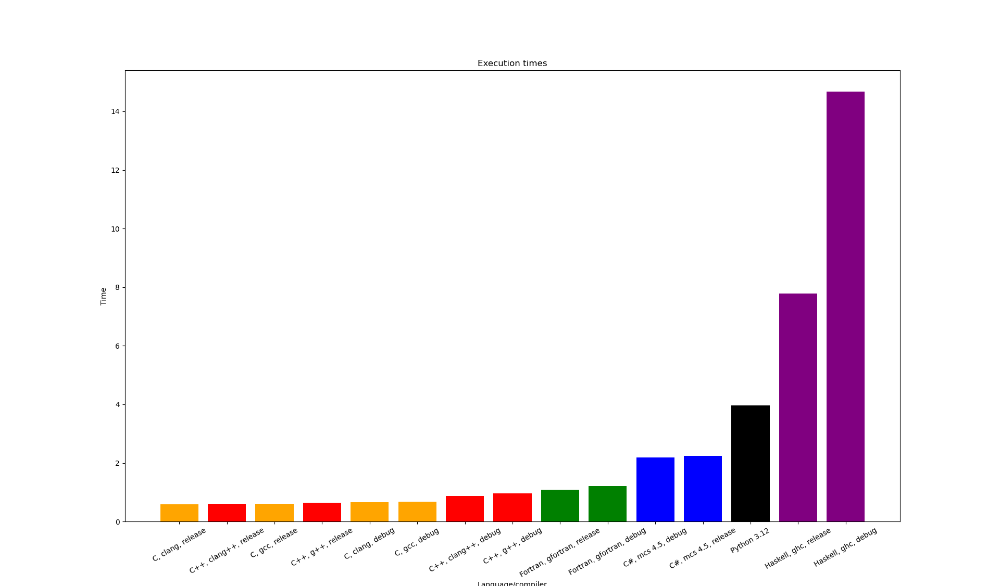

### Proving that C++ is not slow, it's just a skill issue

This repository contains implementations of Dijkstra algorithm in different programming languages. Quick peek at the results:


All data is included, you are welcome to play with the configuration of the visualizer. The current result was produced with `../create_graphics.py --reverse --inverse --relative-slowest`.

### Goal
The benchmark is a combined benchmark that strives to capture a performance of an average and reasonably-written program. The "reasonable" code is defined as code that:
 - Stays readable
 - In particular, accesses structure members by names rather than by index
 - Stays native, does not delegate the task to other programming languages
 - Does not use assembler optimizations
 - Does not use hardware acceleration
 - Uses standard I/O (one exception)
 - Does not use multithreading (one exception)

The execution time is affected by:
 - Raw speed
 - Efficiency of memory management
 - Efficiency of standard library
 - Input/output speed
 - Initialization time
 - etc.

The benchmark does not focus on only one of these aspects. Finding out which exactly part is faster in which languages is outside of the scope of this benchmark.

### Notes
The names of the bars on the chart are pretty self-explanatory. Except for:
 - `C, clang++, release` is a C program compiled with clang++ as valid C++.
 - `C, clang, map+threads` is a C program written with multi-threading support and memory mapping enabled. It is written as a demonstration, comparing its performance to other programs is **not fair**.

### Hardware
The measurements were performed on Intel Pentium 4415U. To reduce noise, the kernel was booted with `isolcpus=1,3`, where 1 and 3 are logical cores that correspond to physical core 1.

### Software
```
GCC      13.3.1
Clang    19.1.4
GFortran 13.3.1
MCS      6.12.0.199, TARGET 4.5
Python   3.12.8
GHC      9.4.8
Matlab   24.2.0.2833386 (R2024b) Update 4
Kernel   6.10.10-zen1-x86_64
```

### Conclusions
 - C++ is faster than C (see "Goal")
 - Fortran is not that fast