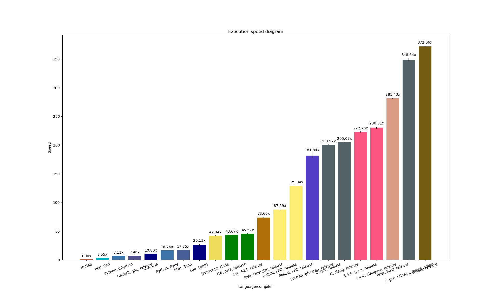

### Proving that C++ is not slow, it's just a skill issue

This repository contains implementations of Dijkstra algorithm in different programming languages. Quick peek at the results:


All data is included, you are welcome to play with the configuration of the visualizer. This graph was produced with: `cd data && ../script/create_graphics.py --reverse --inverse --relative-slowest --no-debug --no-extras`.

### Goal
The benchmark is a combined benchmark that strives to capture a performance of a **reasonably-written** and **balanced** program.

A "reasonable" code is a code that:
 - Stays readable
 - In particular, accesses structure members by names rather than by index
 - Stays native, does not delegate the task to other programming languages
 - Does not use third party libraries
 - Does not use assembler optimizations
 - Does not use hardware acceleration
 - Does not use multithreading
 - Uses standard I/O
 - Does not leak memory
 - Does not assume any prior knowledge about the program input

A "balanced" program is a program that does all types of operations that you'd expect a non-computation-heavy utility to do, in close-to-real-life proportions. It includes:
 - Logics
 - Floating-point operations
 - Memory management
 - Routines from the standard library
 - Input and output
 - Initialization and finalization
 - etc.

The benchmark does not focus on only one of these aspects. Finding out which exact part is faster in which languages is outside of the scope of this repository.

### Notes
The tests were composed in such a way that `C` and `C++` spend approximately the same time on parsing the file and solving the problem, therefore equating the impact of all parts of the program. The comparison chart is known to be qualitatively different when using smaller problem.

The names of the bars on the chart are pretty self-explanatory. Except for:
 - `C, gcc, freestanding` is a `x86_64`-specific C code that uses custom memory management, custom I/O and no standard library. It is therefore considered **CHEATING**. The reason this version is present is because I can translate this version in Assembly (coming soon). Since there is no standard I/O in Assembly, the Assembly translation of this version would be considered legit. Also it is worth knowing whether the improvement of the Assembly version comes from it being written in Assembly or from not using standard I/O.
 - `C, gcc, freestanding/mapping` is same but using memory mapping rather than standard file I/O.
 - `C, g++` is a `C` program compiled with `g++` as valid `C++`.
 - `C, g++, restrict` is a `C` program compiled with `g++` as valid `C++` with the compiler-specific `__restrict__` keyword.
 - `C, clang++` and `C, clang++, restrict` are same but for `clang++`.

My knowledge of programming languages is not on the same level, and not all implementations are created equally. Here are my comments on the probability of improvement:
 - All interpreted languages do little optimizations, therefore it is always possible to optimize the code by using fewer variables, shorter names and otherwise making code less readable. I will call it "micromanagement". Some minor improvements with help of micromanagement are to be expected.
 - `C++`: reference implementation, well-researched and well-optimized.
 - `C`, `Fortran`: direct translation, the optimizing compiler is powerful, no improvement is expected.
 - `Pascal`, `C#`, `Java`: direct translation, the optimizing compiler is not great, improvement may be achieved by micromanagement.
 - `Python`, `JS`, `Lua`: not well-researched, improvement may be achieved by micromanagement and different data structures.
 - `PyPy`: the implementation in `Python` relied on the fact that native priority queue is available, but indexed priority queue is not. Therefore `PyPy`'s optimal algorithm may be different from the `Python`'s one.
 - `Matlab`: I highly doubt that something can be done to the algorithm, though improvement through micromanagement is extremely likely.
 - `Delphi`: since Pascal is (roughly) a subset of Delphi, the improvement can be achieved by simply downgrading to Pascal.
 - `Haskell`: further improvements are probable. Better Haskell knowledge is required.

### Hardware
The measurements were performed on Intel Pentium 4415U. To reduce noise, the kernel was booted with `isolcpus=1,3`, where 1 and 3 are logical cores that correspond to physical core 1.

### Software
```
GCC                  14.2.1
Clang                19.1.7
GFortran             14.2.1
Free Pascal Compiler 3.2.2
MCS                  6.12.0.199, Target 4.5
.NET                 9.0.101
Java                 21.0.7
Python               3.13.3
GHC                  9.8.4
Node                 22.13.1
Lua                  5.4.6
LuaJIT               2.1.1731601260
Matlab               24.2.0.2833386 (R2024b) Update 4
Kernel               6.12.10-zen1-x86_64
```

### Conclusions
 - C++ is faster than C (on this benchmark, under "reasonability" constraint, due to faster I/O [read further](https://github.com/kyrylo-sovailo/benchmark_masterrace))
 - Fortran is not that fast
 - Clang is faster than GCC